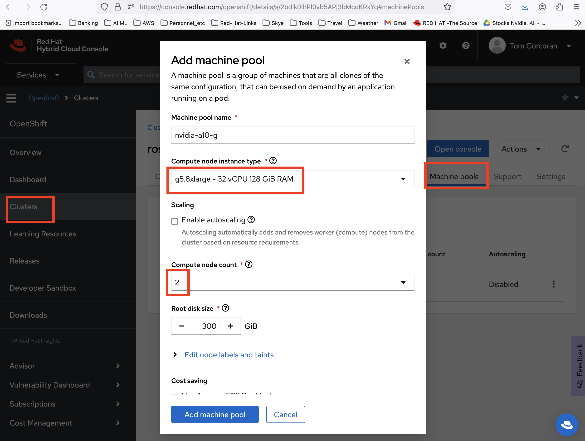
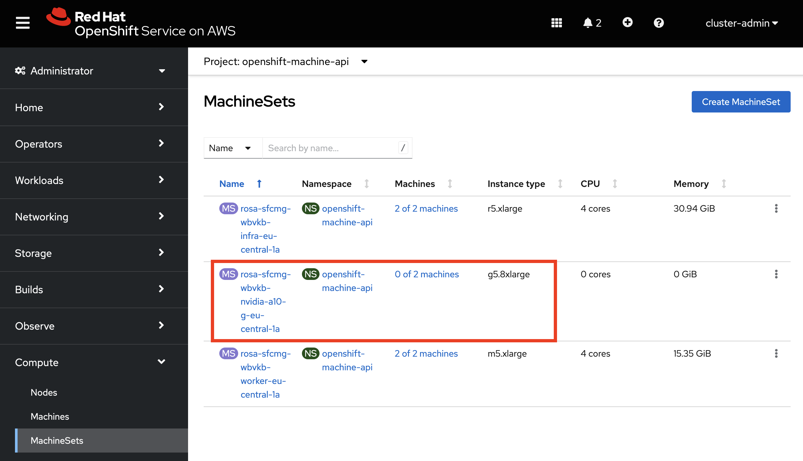

<!-----

You have some errors, warnings, or alerts. If you are using reckless mode, turn it off to see inline alerts.
* ERRORs: 0
* WARNINGs: 0
* ALERTS: 2

Conversion time: 0.979 seconds.

Using this Markdown file:

1. Paste this output into your source file.
2. See the notes and action items below regarding this conversion run.
3. Check the rendered output (headings, lists, code blocks, tables) for proper
   formatting and use a linkchecker before you publish this page.

Conversion notes:

* Docs to Markdown version 1.0β35
* Mon Jan 29 2024 16:27:21 GMT-0800 (PST)
* Source doc: 1-cluster-setup
* This document has images: check for >>>>>  gd2md-html alert:  inline image link in generated source and store images to your server. NOTE: Images in exported zip file from Google Docs may not appear in  the same order as they do in your doc. Please check the images!

WARNING:
You have 3 H1 headings. You may want to use the "H1 -> H2" option to demote all headings by one level.

----->

>>>>>  gd2md-html alert:  ERRORs: 0; WARNINGs: 1; ALERTS: 2.

<ul style="color: red; font-weight: bold"><li>See top comment block for details on ERRORs and WARNINGs. <li>In the converted Markdown or HTML, search for inline alerts that start with >>>>>  gd2md-html alert:  for specific instances that need correction.</ul>

Links to alert messages:
<a href="#gdcalert1">alert1</a>
<a href="#gdcalert2">alert2</a>

>>>>> PLEASE check and correct alert issues and delete this message and the inline alerts.

# Prerequisites

An OpenShift (OCP) 4.12 (or later) Cluster with access to to Nvidia A10G GPUs (i’m using ROSA based out of eu-central-1) which makes those GPUs available with the g5.8xlarge instance types.

**Warning - these GPU instance types are expensive - so be sure to take care in how long you have them running.**

# Setup

Either on the OCP Machinesets screen or in your [https://console.redhat.com/openshift](https://console.redhat.com/openshift) account, add two g5.8xlarge nodes to your cluster as shown

## Console.redhat.com

If you have a ROSA cluster, open it and add a Machine Pool as shown

>>>>>  gd2md-html alert: inline image link here (to images/image1.png). Store image on your image server and adjust path/filename/extension if necessary.  (<a href="#">Back to top</a>)(<a href="#gdcalert2">Next alert</a>) >>>>> 

## Directly add a Machineset

If your cluster is not contriolled from console.redhat.com, you directly add a machineset of this type and scale it to 2 - [as described here](https://docs.openshift.com/container-platform/4.14/machine_management/creating-infrastructure-machinesets.html). i.e. on this screen

>>>>>  gd2md-html alert: inline image link here (to images/image2.png). Store image on your image server and adjust path/filename/extension if necessary.  (<a href="#">Back to top</a>)(<a href="#gdcalert3">Next alert</a>) >>>>> 

# Steps
