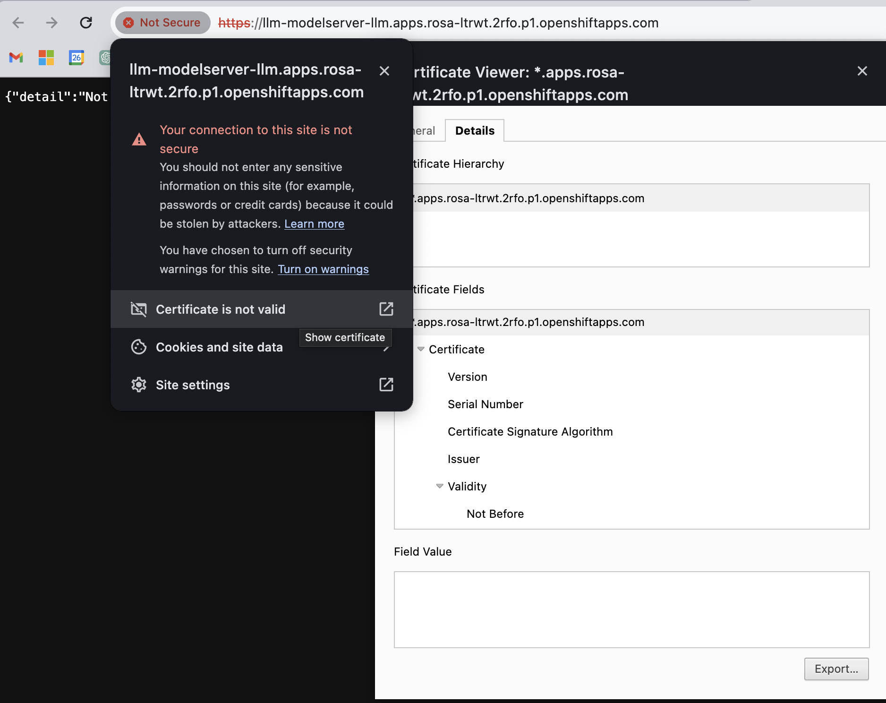

# Instructions

- Install a Model Server
- export URL, Port and Model Server name
    ```
    HOST="https://llm-modelserver-llm.apps.rosa-ltrwt.2rfo.p1.openshiftapps.com"

    PORTNUMBER=443

    SERVERNAME="llm-model-server"
```
 - Download the cert from the model server - click Insecure on URL the details then Export
    ```


- Run this to convert it to a .pem file
    ```
    openssl x509 -in /tmp/$SERVERNAME.cert -out /tmp/$SERVERNAME.pem
    ```

